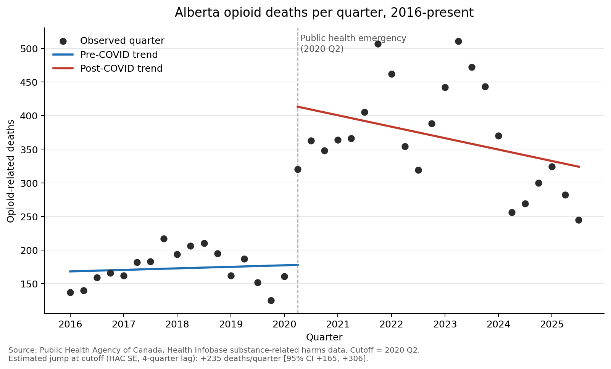

# Alberta opioid mortality and COVID-19: interrupted time series

Short personal analysis of how Alberta's opioid death rate shifted around the
COVID-19 onset, using federal data and an interrupted time series (ITS)
specification with quarter fixed effects, placebo cutoffs, and a negative
binomial cross-check.

This is a learning project I built in an afternoon to refresh my hands-on
work with time-series policy data. It is not affiliated with my employer and
does not use any internal data.

## Question

Did Alberta's opioid death rate shift at a level higher than the pre-COVID
trend can explain, starting from 2020 Q2?

## Data

- **Outcome:** Public Health Agency of Canada, Health Infobase, Substance-
  Related Harms Data ([health-infobase.canada.ca](https://health-infobase.canada.ca/substance-related-harms/opioids-stimulants/)).
  Downloaded 2026-05-20. I use Alberta, opioids, deaths, quarterly counts,
  overall (no demographic disaggregation). 39 quarters: 2016 Q1 – 2025 Q3.
- **Denominator:** Statistics Canada Table 17-10-0009-01, quarterly
  population estimates by province.

Both raw files are included under `data/` for reproducibility.

## Method

This is an **interrupted time series with a level and slope change**
(segmented regression). When time is the running variable this is sometimes
called regression discontinuity in time (Hausman and Rapson 2018), but I do
not invoke RD-style local-randomization arguments. Identification rests on a
correctly specified counterfactual trend, not on continuity of potential
outcomes at the cutoff.

Outcome is modelled as **deaths per 100,000 Alberta residents** to net out
population growth over the 10-year window (Alberta grew ~4.4M → 4.9M).

```
rate_t  =  α  +  β1·(t − cutoff)  +  β2·post  +  β3·(t − cutoff)·post  +  γ·Quarter_FE  +  ε
```

- `cutoff = 2020 Q2` - first full quarter under Alberta's public health
  emergency (declared 2020-03-17).
- `Quarter_FE` - quarter-of-year dummies (Q4 reference) to absorb
  seasonality.
- Newey-West HAC standard errors with small-sample correction; 3-lag is
  the data-driven choice for quarterly data with this T, sensitivity at
  1 / 2 / 3 / 4 / 6 lags is reported below.

`β2` is the immediate level shift at the cutoff, conditional on the linear
post-trend and quarterly seasonality.

## Findings

Main specification (rate per 100k per quarter, segmented regression with
quarter FE, HAC SE 3-lag, small-sample correction):

| Quantity | Estimate |
| --- | --- |
| Level shift at 2020 Q2 cutoff | **+5.50 deaths per 100k per quarter** [95% CI +3.60, +7.39], p < 0.001 |
| At mean AB population (4.48M) this is | ≈ +246 deaths per quarter [+162, +331] |
| Pre-COVID slope | −0.02 per 100k per quarter (p = 0.94, flat) |
| Pre-COVID mean rate (2016 Q1 – 2020 Q1) | 4.05 per 100k per quarter |
| Post-COVID mean rate (2020 Q2 onward) | 7.99 per 100k per quarter |

The pre-COVID period is flat, so the jump is not part of an existing trend.



### Robustness

**HAC lag sensitivity.** Estimate is constant at +5.50 across maxlags
{1, 2, 3, 4, 6}; SE varies in a narrow band (0.79–0.98). Inference does not
hinge on the lag choice.

**Donut (drop transitional 2020 Q1).** Jump = +5.34 [95% CI +3.52, +7.16].
Estimate moves <3%.

**Placebo cutoffs** (re-fit using only 2016 Q1 – 2020 Q1 data, with fake
cutoffs in the pre-period):

| Fake cutoff | Estimated "jump" |
| --- | --- |
| 2018 Q1 | −0.07 |
| 2018 Q2 | −0.19 |
| 2018 Q3 | −0.44 |
| 2018 Q4 | −0.95 |
| 2019 Q1 | −1.30 |
| 2019 Q2 | −1.14 |
| 2019 Q3 | −1.86 |
| **2020 Q2 (real)** | **+5.50** |

The largest absolute placebo jump (1.86) is roughly **one third** the real
estimate, and all placebos point in the opposite direction (mild
*decreases* in the pre-period). The real cutoff is well outside the placebo
distribution.

**Negative binomial cross-check.** GLM with log-population offset and
quarter FE produces a post-cutoff rate ratio of **2.43** (95% CI 1.80, 3.26),
i.e. the post-cutoff rate is roughly 2.4× the pre-cutoff rate at the cutoff.
This is consistent with the linear-rate result and confirms the conclusion
does not depend on the OLS/Gaussian assumption.

## What this identifies - and what it doesn't

**What the estimate captures:** the **total effect of the COVID-19
pandemic** on Alberta opioid mortality, including the bundle of social and
policy responses the pandemic required (border closures and supply chain
disruption in the unregulated drug supply, reduced harm-reduction service
capacity, mental-health service disruption, social isolation, and the
economic shock). These are not parallel causes that happened to align with
COVID; they are downstream consequences that came with the pandemic by
construction. A pandemic without policy response is not a counterfactual
that exists in any data.

**What it does not do:** decompose that total effect into its component
mechanisms. The estimate cannot tell you what share of the +5.50 per 100k
came from supply toxicity vs. service capacity loss vs. isolation vs. the
economic shock. That is a separate, mechanism-level question.

**Why a peer-province comparison would not fix this.** All Canadian
provinces faced COVID and its policy response at essentially the same time
(emergencies declared within days of each other in March 2020). A
difference-in-discontinuities or synthetic-control design comparing
Alberta to BC or Ontario would identify Alberta-specific deviation from
the common pandemic pattern, not a clean "COVID-only" effect - because no
province offers a counterfactual without COVID and its policy response.

## Other limitations

- **Post-period is non-monotonic.** The post-cutoff series peaked in 2021 Q4
  and has been declining since 2024. `β2` measures the immediate level shift
  at the cutoff conditional on a linear post-trend; it is not the average
  treatment effect over the full post-period.
- **No demographic stratification.** Alberta-level totals mask substantial
  age, sex, and zone heterogeneity that any real Ministry analysis would
  surface.
- **No substance decomposition.** The headline number bundles fentanyl,
  carfentanil, and other opioids in a single total.
- **Reporting lag and revisions.** Health Infobase notes the data is subject
  to revision; the most recent quarters may move.
- **Small sample for HAC asymptotics.** n = 39 is at the lower end of where
  Newey-West asymptotics are reasonable. Wild-cluster bootstrap or
  randomization inference from the placebo distribution would be a tighter
  inference procedure; the placebo results above are a partial substitute.

## What I would do next

The total pandemic effect is identified; the natural follow-ups are
mechanism-level and policy-relevant questions, not attempts at "sharper
identification of COVID."

1. **Mechanism decomposition.** Triangulate across supply-side signals
   (drug-checking composition, fentanyl share), service-capacity signals
   (supervised consumption hours, OAT dispensing), and outcome signals
   (deaths, EMS, ED) to attribute share of the total to plausible channels.
2. **Heterogeneity.** Stratify by age, sex, zone, and substance type to
   identify where the level shift concentrated.
3. **Post-period dynamics.** Model the rise-and-decline shape directly
   (post-period peak in 2021 Q4, recovery beginning in 2024) rather than
   collapsing it into a single level shift.
4. **Cumulative excess deaths through end-of-sample.** A policy-relevant
   quantity alongside the immediate level shift.
5. **Substance composition over time.** Use the `Type of opioids` rows in
   the same dataset to separate composition change in the unregulated
   supply from broader uptake patterns.

## Reproducing

```
pip install -r requirements.txt
python3 analysis.py
```

Output goes to `output/rdit_opioid_deaths.png` and `output/results.txt`.

## License

Code: MIT. Data: redistributed under the originating agencies' open data
terms (PHAC Health Infobase, Statistics Canada).
